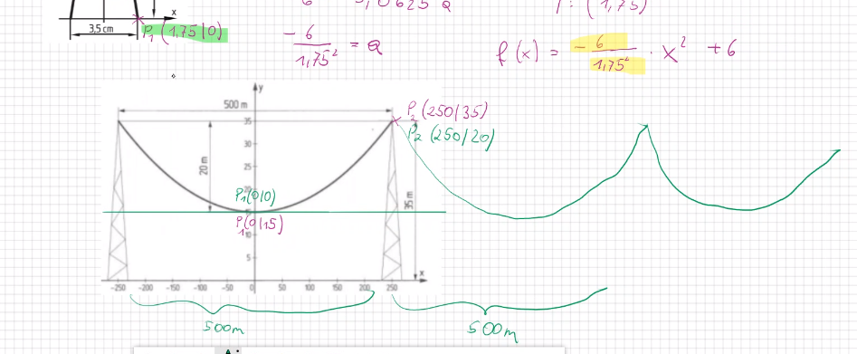

= Berdan
:author: Berdan Kadir berdankadir12@gmail.com
:doctype: book
:sectanchors:
:toc:
:sectnums:
:disclainer: Dies ist mein Disclainer Text
:imagesdir:./images

== hello
{disclainer}

=== B

<<<
//neue seite

* hallo
- ha

CPU:: hallo
Keyboard:: jo
asas:: sd.kfdk

== C
=== c1
{disclainer}

Das Wort wird *fett*  ged**ruckt**t

Sie schreiben eine #Methode# `main()`

Ein Projet    ist k +
ffff jdfbd

er
ererere
edgrgdgg

f

[source,java]
----
public static void main(String[]args)
{
    System.outprintln("hello")
}
----
